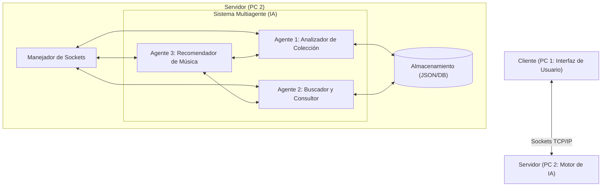

# Planeación del Proyecto: Sistema de Recomendación de Música Física con Agentes de IA

Este documento detalla la planeación y arquitectura para el proyecto de Inteligencia Artificial en **Java**. El sistema conecta dos computadoras mediante sockets y utiliza un sistema multiagente (3 agentes) para gestionar, buscar y recomendar discos físicos (CDs y vinilos).

---

## 1. Arquitectura General del Sistema

El sistema utiliza una arquitectura **Cliente-Servidor** mediante sockets TCP/IP estándar de Java. Esto garantiza una conexión orientada a conexión, confiable y bidireccional.



---

## 2. Definición de los Agentes de IA (3 Agentes)

Para cumplir con el requerimiento de forma eficiente y enfocada en IA, se proponen exactamente 3 agentes con responsabilidades delimitadas y cooperativas:

### Agente 1: Analizador de Colección (Collection Analyzer Agent)
*   **Propósito:** Procesar y estructurar la información de los discos físicos registrados por el usuario.
*   **Tareas:**
    *   Clasificar los discos por géneros, subgéneros, épocas (décadas) y niveles de rareza/formato (CD vs. Vinilo).
    *   Crear un **perfil de gustos musicales** del usuario (matriz de pesos de géneros musicales basados en la frecuencia y peso de artistas en la colección).
*   **Enfoque de IA:** Clasificación bayesiana simple o asignación de pesos heurísticos para determinar la afinidad del usuario.

### Agente 2: Buscador y Consultor (Search & Query Agent)
*   **Propósito:** Gestionar la búsqueda de nuevos álbumes y procesar las peticiones del usuario.
*   **Tareas:**
    *   Buscar álbumes en el catálogo disponible (simulado o mediante alguna API externa básica).
    *   Interpretar la intención de búsqueda del usuario (búsquedas difusas, por artista, año o género).
*   **Enfoque de IA:** Procesamiento de texto básico/búsqueda semántica simple o algoritmos de coincidencia difusa (Fuzzy Matching como distancia Levenshtein) para mejorar las consultas de búsqueda.

### Agente 3: Recomendador de Música (Recommendation Agent)
*   **Propósito:** Generar recomendaciones personalizadas cruzando los datos del Agente 1 y Agente 2.
*   **Tareas:**
    *   Tomar el perfil de gustos generado por el **Agente 1**.
    *   Evaluar el historial de búsquedas del **Agente 2**.
    *   Calcular la similitud entre los álbumes no poseídos y el perfil del usuario para sugerir nuevas adquisiciones.
*   **Enfoque de IA:** Filtro basado en contenido (Content-Based Filtering) usando métricas de similitud (como la similitud de coseno en vectores de características de géneros/artistas).

---

## 3. Protocolo de Comunicación (Sockets)

La comunicación se estructurará mediante mensajes serializados en formato JSON (usando bibliotecas como Gson o Jackson) para facilitar la interoperabilidad y legibilidad.

### Estructura de Mensaje
```json
{
  "transaccionId": "UUID-12345",
  "accion": "REGISTRAR_DISCO | BUSCAR_ALBUM | OBTENER_RECOMENDACIONES",
  "datos": { ... },
  "timestamp": 1717791600
}
```

### Flujos Principales:
1.  **Registro de Disco:**
    *   *Cliente* envía un JSON con los datos del nuevo vinilo/CD.
    *   *Servidor* recibe, almacena, e invoca al **Agente 1** para actualizar el perfil del usuario.
2.  **Solicitud de Recomendación:**
    *   *Cliente* solicita recomendaciones.
    *   *Servidor* invoca al **Agente 3**, el cual interactúa con el **Agente 1** (para ver qué posee) y el **Agente 2** (para ver qué ha buscado) y devuelve la lista recomendada.

---

## 4. Estructura de Datos Propuesta (Java)

*   `Disco.java`: Representa un álbum físico (ID, Título, Artista, Año, Género, Formato [CD/Vinilo]).
*   `PerfilUsuario.java`: Almacena las preferencias analizadas por el Agente 1 (mapa de afinidad por género).
*   `MensajeSocket.java`: Clase encargada de estructurar los envíos de red.
